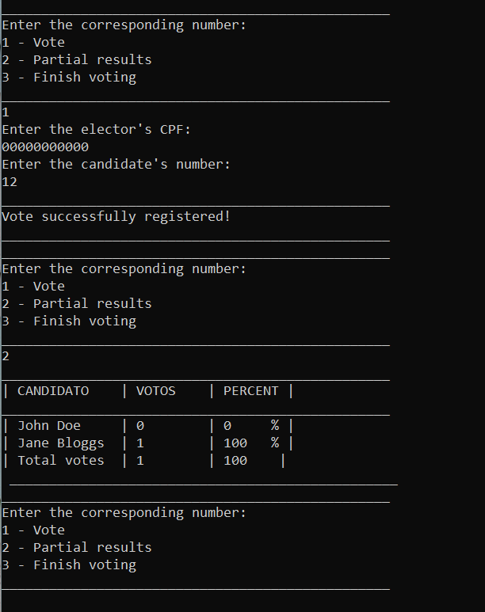

# 🗳️ Java Voting System

## 🇺🇸 About this project

This is a simple voting system developed using Java. It enables the registration of candidates and electors, as well as the calculation of vote counts and showcases the final results.

## 📝 Installation/Usage

> ⚠️ Make sure you have JRE (Java Runtime Environment) installed

1. Download and extract the `.zip` file
2. Using the terminal, navigate to the project's `target` directory
3. Run the `.jar` file using the command `java -jar votingManagementSystem-jar-with-dependencies.jar`

> 💬 If you have any suggestions or feedbacks, I would be happy to receive them through <a href="https://www.linkedin.com/in/bshiromoto/" target="_blank">LinkedIn</a>!

## 🇧🇷 Sobre este projeto

Este é um sistema de votação simples desenvolvido utilizando Java. Ele permite o registro de eleitores e candidatos, além de calcular a contagem de votos e apresentar os resultados apurados.

## 📝 Instalação/Uso

> ⚠️ Certifique-se de ter o JRE (Java Runtime Environment) instalado.

1. Faça o download e extraia o arquivo `.zip`
2. Usando o terminal, navegue até o diretório `target` do projeto
3. Execute o arquivo `.jar` usando o comando `java -jar votingManagementSystem-jar-with-dependencies.jar`

> 💬 Se tiver alguma sugestão ou feedback, eu ficaria feliz em recebê-los pelo meu <a href="https://www.linkedin.com/in/bshiromoto/" target="_blank">LinkedIn</a>!

## 🖼️ Screenshots

  

## 🛠️ Technologies used/Tecnologias utilizadas
### Programming languages/Linguagens de programação:

### Tools and platforms/Ferramentas e plataformas:

